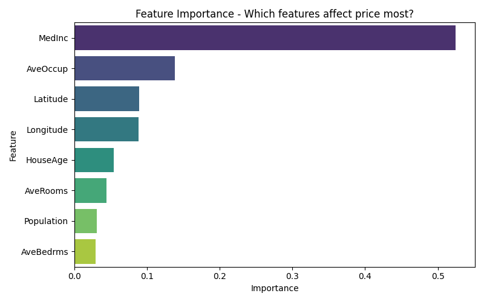

# 🏠 House Price Predictor

A machine learning project that predicts California house prices using Linear Regression and Random Forest. Built using the California Housing Dataset from scikit-learn.

---

## 📊 Project Overview

This project walks through a complete ML pipeline:
- Loading and exploring real housing data (20,640 samples)
- Exploratory Data Analysis (EDA) with visualizations
- Training and comparing two regression models
- Evaluating models using MAE, RMSE, and R² metrics
- Predicting price for a custom house input

---

## 🎯 Results

| Model | MAE | RMSE | R² Score |
|-------|-----|------|----------|
| Linear Regression | $53,320 | 0.7456 | 57.6% |
| **Random Forest** | **$32,754** | **0.5053** | **80.5%** |

> Random Forest significantly outperformed Linear Regression by capturing complex non-linear patterns in the data.

---

## 🔑 Key Insight

**Median Income (52%)** is the most important feature for predicting house prices — far more than the number of rooms or house age.



---

## 📁 Project Structure

```
house-price-predictor/
│
├── house_price.py              # Main script
├── requirements.txt            # Dependencies
├── price_distribution.png      # Plot: distribution of prices
├── correlation_heatmap.png     # Plot: feature correlations
├── feature_vs_price.png        # Plot: income & rooms vs price
└── feature_importance.png      # Plot: Random Forest feature importance
```

---

## 🛠️ Tech Stack

| Library | Purpose |
|---------|---------|
| `pandas` | Data loading and manipulation |
| `numpy` | Numerical operations |
| `matplotlib` | Basic plotting |
| `seaborn` | Statistical visualizations |
| `scikit-learn` | ML models, metrics, preprocessing |

---

## 🚀 How to Run

**1. Clone the repository**
```bash
git clone https://github.com/subham23s/house-price-predictor.git
cd house-price-predictor
```

**2. Create and activate virtual environment**
```bash
python -m venv venv
venv\Scripts\activate        # Windows
source venv/bin/activate     # Mac/Linux
```

**3. Install dependencies**
```bash
pip install -r requirements.txt
```

**4. Run the project**
```bash
python house_price.py
```

No dataset download needed — the California Housing dataset loads automatically from scikit-learn!

---

## 📈 Visualizations Generated

- **Price Distribution** — histogram showing how house prices are spread
- **Correlation Heatmap** — which features relate most to each other
- **Feature vs Price** — scatter plots of Income and Rooms vs Price
- **Feature Importance** — which features matter most in Random Forest

---

## 🧠 What I Learned

- How to perform EDA before modeling
- Difference between Linear Regression and Random Forest
- How StandardScaler improves Linear Regression performance
- How to interpret MAE, RMSE, and R² score
- Feature importance in tree-based models

---

## 👨‍💻 Author

**Subham Mishra**  
BTech 2nd Year | CSE (AI/ML)  
[](https://www.linkedin.com/in/subhammishra23/)


---

## 📌 Part of My Daily AI/ML Build Challenge

This is **Day 2** of my daily AI/ML project building challenge.  
Check out my other projects on [GitHub](https://github.com/subham23s).